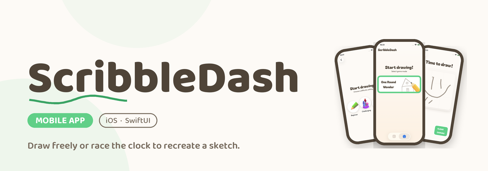
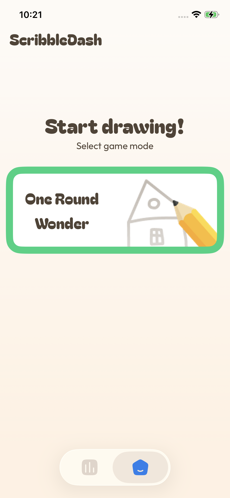
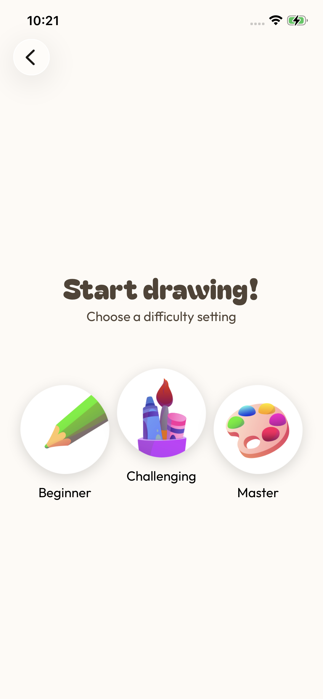
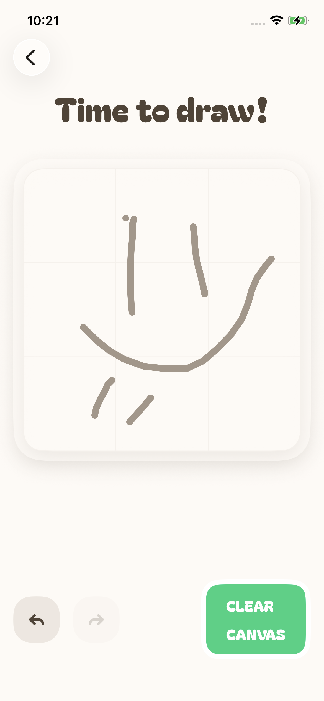

**ScribbleDash** is a native iOS app built by [@ismaelcordon](https://github.com/icdominguez) and [@galahseno](https://github.com/galahseno), born out of wanting to have fun together while taking our first real steps into Swift development. The original design was provided by Philipp Lackner's community, and from there we've made it our own — tweaking some pieces and adding others along the way.
                                                            
## Project Status

This project is being built across several milestones, each one unlocking a new part of the app. A new
requirements document and an updated Figma file are provided for every milestone.
                                                               
- ✅ **Milestone #1** — Free drawing canvas with undo/redo
- ⬜ Milestone #2
- ⬜ Milestone #3
- ⬜ Milestone #4
### 🚨 Latest Features (Milestone #1) ###
                                                               
- **Home Screen**
   - App title pinned to the top-left corner.
   - Centered "Start drawing!" section with a **One Round Wonder** game mode card (thick green border, name on the left, illustration on the right).
   - Bottom navigation bar with a Home destination (the second destination will be revealed in the next milestone).
- **One Round Wonder flow**
   - **Difficulty Selection Screen** — choose between **Beginner**, **Challenging** and **Master**, each tapping
 through to the drawing canvas.
   - **Draw Screen** — a 1:1 canvas with rounded corners and a 3x3 grid overlay to help you compose your sketch.
- **Drawing engine**
   - Freehand path drawing on the canvas.
   - **Undo** — removes the last drawn path (keeps a stack of up to 5).
   - **Redo** — restores the most recently undone path; the redo stack is cleared as soon as a new path is drawn.
   - **Clear Canvas** — wipes every path and the undo/redo history in one tap.
   - Undo, Redo and Clear Canvas buttons disable themselves automatically when there's nothing to act on.

 ## 🧑‍💻 Technical implementation
                                                               
- ✅ SwiftUI
- ✅ MVVM architecture
- ✅ Swift Concurrency
- ✅ Xcode project, no external dependencies required
                                                              
## 🎥 Demo ##

https://github.com/user-attachments/assets/892bc729-9333-4f90-8fdf-f09d31f41ea0
                                                              
## 📱 Screenshots ##

<details>
   <summary>Home</summary>

   | Mobile                                                                   |
   |--------------------------------------------------------------------------|
   |               |

</details>

<details>
   <summary>Difficulty Selection Screen</summary>

   | Mobile                                                                   |
   |--------------------------------------------------------------------------|
   |               |

</details>

<details>
   <summary>Draw Screen</summary>

   | Mobile                                                                   |
   |--------------------------------------------------------------------------|
   |               |

</details>


## 🛠️ Setup
 
1. Clone the repo:
```
   git clone https://github.com/galahseno/ScribbleDash.git
```
2. Open `ScribbleDash.xcodeproj` in Xcode.
3. Build and run on a simulator or device (no API keys or extra configuration needed for this milestone).
## 🪪 License
 
This project is open-source and free to use. Feel free to fork and build on top of it.
 
## Acknowledge
 
- Swift concurrency.
- Canvas gesture handling.
- Swift Data.
- Creation and maintainance of provision profiles, Bundle IDs & iOS Distribution certificates.
